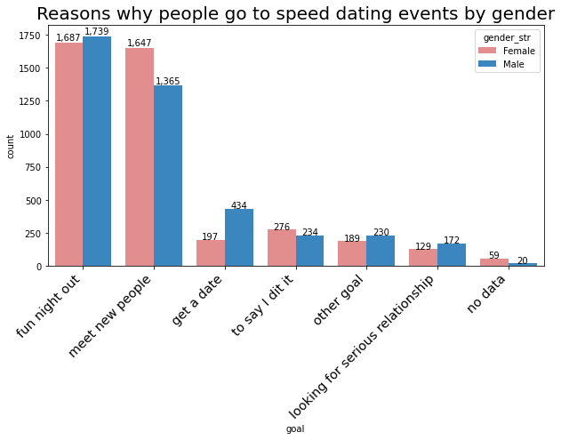

# Speed dating experiment - Exploratory Data Analysis (EDA)

### by Kamila Hamalcikova

## Dataset

The dataset cointains records from 8378 participants of Speed Dating Experiment. Data can be found in [Kaggle dataset](https://www.kaggle.com/annavictoria/speed-dating-experiment). They consists mainly of general info about each participant, attributes they look for in speed dating partner and their matching decisions.

## Installation

- Anaconda
- Jupyter Notebook
- Python 3.6
- Python libraries (Pandas, Numpy, Seaborn, Matplotlib)

## Key Findings

- When focusing on difference between speed dating behaviour of men and women, we found out that in general women participating in speed dating events are younger than men and are more represented in groups of minorities when looking on different races. Men participating in speed dating are older and less represented in groups of minorities, but more represented in Caucasian race. No significant difference was observed in income distribution by gender.

- Men in speed dating events are far more interested in finding attractive women, other attributes of women are not that important for men. Women are looking for intelligent men in first place, while attractive and sincere men are closely in second and third place. Importance of shared interests or being ambitious is the least important attribute for both genders when speed dating is concerned.

- Successful match is strongly correlated with decision to match of speeding partner. This correlation is slightly stronger for men then for women. In the other words, men get more often their preferable speed dating match they want than women.
